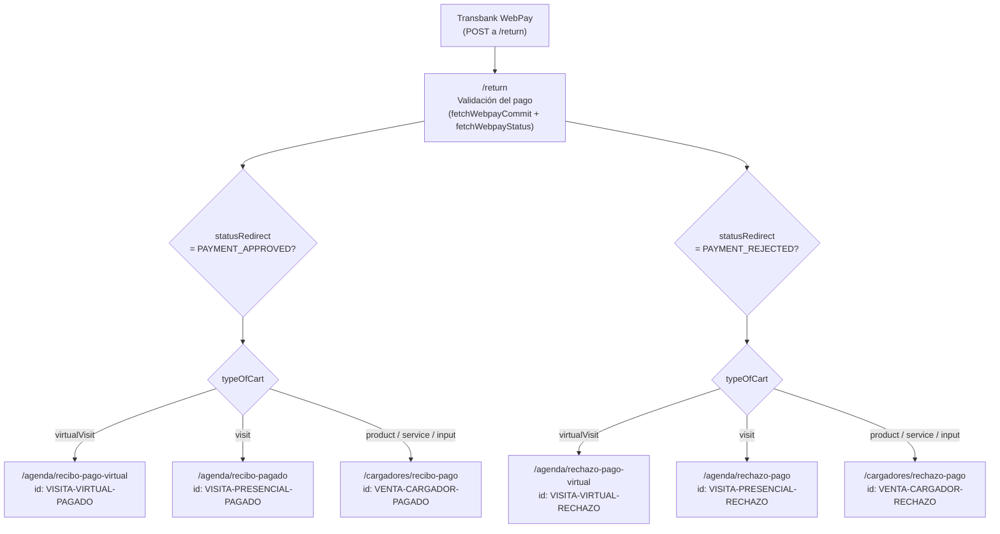

# Páginas de Gracias — Flujo de Pago WebPay

Documentación del flujo de redirección post-pago de Transbank WebPay hacia las páginas de confirmación/rechazo según el tipo de carrito (`typeOfCart`).

---

## Diagrama de flujo



---

## Tabla resumen

| typeOfCart | Estado pago | Ruta | HTML id | Archivo |
|---|---|---|---|---|
| `virtualVisit` | APPROVED | `/agenda/recibo-pago-virtual` | `VISITA-VIRTUAL-PAGADO` | `src/app/agenda/recibo-pago-virtual/page.tsx` |
| `virtualVisit` | REJECTED | `/agenda/rechazo-pago-virtual` | `VISITA-VIRTUAL-RECHAZO` | `src/app/agenda/rechazo-pago-virtual/page.tsx` |
| `visit` | APPROVED | `/agenda/recibo-pagado` | `VISITA-PRESENCIAL-PAGADO` | `src/app/agenda/recibo-pagado/page.tsx` |
| `visit` | REJECTED | `/agenda/rechazo-pago` | `VISITA-PRESENCIAL-RECHAZO` | `src/app/agenda/rechazo-pago/page.tsx` |
| `product` / `service` / `input` | APPROVED | `/cargadores/recibo-pago` | `VENTA-CARGADOR-PAGADO` | `src/app/cargadores/recibo-pago/page.tsx` |
| `product` / `service` / `input` | REJECTED | `/cargadores/rechazo-pago` | `VENTA-CARGADOR-RECHAZO` | `src/app/cargadores/rechazo-pago/page.tsx` |

---

## Cómo funciona el traspaso de datos

La página `/return` guarda los datos del pago en `sessionStorage` antes de redirigir:

```ts
sessionStorage.setItem('paymentData', JSON.stringify({
  glosa,        // descripción del producto/servicio
  total,        // monto cobrado
  order,        // número de orden Transbank
  card,         // últimos 4 dígitos tarjeta
  typePay,      // tipo de pago (VN, VC, SI, etc.)
  email,        // email del comprador
  shoppingCartId,
  typeOfCart,   // determina la redirección
}));
```

Cada página de gracias lee ese dato en `useEffect` y lo elimina de `sessionStorage` una vez procesado (patrón one-time read con `useRef`).

---

## Flujos de Transbank

WebPay puede llegar a `/return` de 4 formas distintas. En todas, se llama `fetchWebpayStatus` para obtener el `typeOfCart`:

| Flujo | Parámetros URL | Descripción |
|---|---|---|
| 1 — Normal OK | `token_ws` | Pago completado (puede ser AUTHORIZED o rechazado) |
| 2 — Timeout | `TBK_ID_SESION` + `TBK_ORDEN_COMPRA` | El usuario tardó más de 10 min en el formulario |
| 3 — Anulado por usuario | `TBK_TOKEN` | El usuario presionó "Anular" en WebPay |
| 4 — Caso atípico | `token_ws` + `TBK_TOKEN` | Pago inválido, contactar banco |

Los flujos 2, 3 y 4 siempre resultan en `PAYMENT_REJECTED`.

---

## Los ids HTML y Google Ads

Los `id` en el `<Box>` principal de cada página son usados por Google Ads para detectar conversiones. Cuando Google Tag Manager detecta que existe un elemento con ese id en el DOM, dispara el evento de conversión correspondiente.

```
VISITA-VIRTUAL-PAGADO      → conversión visita virtual exitosa
VISITA-VIRTUAL-RECHAZO     → evento rechazo visita virtual
VISITA-PRESENCIAL-PAGADO   → conversión visita presencial exitosa
VISITA-PRESENCIAL-RECHAZO  → evento rechazo visita presencial
VENTA-CARGADOR-PAGADO      → conversión venta cargador exitosa
VENTA-CARGADOR-RECHAZO     → evento rechazo venta cargador
```

---

## Contenido de cada página

### Páginas de confirmación (APPROVED)

Muestran:
- Ícono de éxito (✓ verde)
- Tabla de detalle: producto/servicio, total, orden, tarjeta, tipo de pago
- Botones de acción según tipo:
  - **Visitas** → "Agendar otra visita" + "Simular costo de instalación"
  - **Cargadores** → "Seguir comprando" + "Simular costo de instalación"

### Páginas de rechazo (REJECTED)

Muestran:
- Ícono de error (✗ rojo)
- Mensaje explicando el rechazo y la pre-reserva de 30 min (visitas)
- Botones de acción:
  - "Reintentar el pago" (solo si `shoppingCartId` disponible — llama a `fetchWebpayStart` para generar nuevo token)
  - "Agendar otra visita" / "Volver a la tienda"
  - "Crear un ticket de soporte" (link a `/soporte` con parámetros pre-cargados)

---

## Nota sobre recibo-pago-virtual

`/agenda/recibo-pago-virtual/page.tsx` es un re-export de `/agenda/recibo-virtual/page.tsx`:

```ts
export { default } from '../recibo-virtual/page';
```

Ambas rutas sirven el mismo componente. La ruta canónica para redirecciones desde `/return` es `/agenda/recibo-pago-virtual`.
